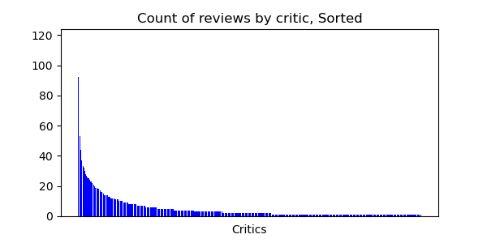

# Comparing Critic and Audience Reviews
### Athen, Donny, and Jim; Oct 5, 2023

***
## Intro
Entertainment review sites frequently show a disparity between critic and audience reviews of movies and shows. This project seeks to find features of those critic reviews that diverge from average audience score of a media product.  

***
## Source Data
In order to make this analysis, we determined we would need a dataset containing at least an average audience score, an average critic score, and a critic review text associated to a large amount of media titles. After some searching we were able to find this:

[Massive Rotten Tomatoes Movies & Reviews](https://www.kaggle.com/datasets/andrezaza/clapper-massive-rotten-tomatoes-movies-and-reviews?select=rotten_tomatoes_movie_reviews.csv), Andrea Villa, uploaded to Kaggle 2023

This is indeed a "massive" dataset, containing some 1.4 million movie reviews. It consists of two csv files, listed here with their data columns:

* rotten_tomatoes_movies.csv: id, title, audienceScore, tomatoMeter, rating, releaseDateTheaters, releaseDateStreaming, runtimeMinutes, genre, director, and boxOffice revenue.

* rotten_tomatoes_movie_reviews.csv: id, reviewId, creationDate, criticName, isTopCritic, originalScore, reviewState, publicationName, reviewText, scoreSentiment, and reviewUrl.

These csv's had all the data we needed between them, in these columns:
* average audience score: audienceScore
* average critic score: tomatoMeter
* critic review text: reviewText
* media title: title
***
## Data Cleaning

* Our first step was to do an inner merge on the two csv's to have all input data within one dataframe. We next created a column for the disparity between critic and audience scores for each movie:
>     massive['delta'] = massive['tomatoMeter'] - massive['audienceScore']

* We then dropped columns that were unlikely to contribute meaningful data to a machine learning model, including the input audience score and critic score used to create 'delta':

>     massive = massive.drop(columns=['originalScore', 'rating', 'ratingContents', 'releaseDateTheaters',
>                                'releaseDateStreaming', 'runtimeMinutes', 'genre', 'originalLanguage',
>                                'director', 'writer', 'boxOffice', 'distributor', 'soundMix', 'reviewUrl',
>                                'id', 'reviewId', 'creationDate', 'isTopCritic', 'reviewState', 'tomatoMeter',
>                                'audienceScore'])


* There were several nulls, all of which were in the four specified data columns and could not be reasonably replaced; all these nulls were dropped. 


* As we are focusing on movies with a large discrepancy between critic and audience scores, we selected reviews where this discrepancy was at least 20% either above or below the audience score:


>     condition = (massive['delta'] >= 20) & (massive['scoreSentiment'] == 'POSITIVE')
>          if condition.any():
>          massive = massive.drop(massive[condition].index)
>     condition = (massive['delta'] <= -20) & (massive['scoreSentiment'] == 'NEGATIVE')
>          if condition.any():
>          massive = massive.drop(massive[condition].index)

* Lastly, we considered that there may be duplicated reviews in the remaining data. To be sure to get rid of these, we dropped duplicates in the 'reviewText' column:

>     massive = massive.drop_duplicates(subset='reviewText', keep='first')
***
## Data Processing

#### Lemmatization
* We lemmatized the text of critic reviews to perform analysis:
```
lemmatizer = WordNetLemmatizer()
import re
def process_text(text): 
    sw = set(stopwords.words('english')) 
    regex = re.compile("[^a-zA-Z ]") 
    re_clean = regex.sub('', text) 
    words = word_tokenize(re_clean) 
    lem = [lemmatizer.lemmatize(word) for word in words] 
    output = ' '.join([word.lower() for word in lem if word.lower() not in sw]) 
    return output
    
massive['reviewText'] = massive['reviewText'].apply(lambda x: process_text(x))
```
#### TFIDF Sentiment Model
* Fit TFIDF vectorizer for sentiment model
* Vectorizing original dataframe to dense array for linear model
    * rename 'title' column to 'title_' as array will contain any use of the word "title" within reviews
    * Create columns for each vectorized word and combine with original dataframe
    * Dropping review text now that vectorized words are all columns
    * Fill nulls with '0'

#### Linear Regression
*  As shown, the number of reviews per critic and per publication were sharply distributed. We therefore decided to sort the right tail of critics and publications into an "other" category before encoding these categorical data columns.



* We therefore decided to sort the right tail of critics and publications into an "other" category before encoding these categorical data columns.
```
counts = combined.criticName.value_counts()
threshold = combined.criticName.isin(counts.index[counts<16])
combined.loc[threshold, 'criticName'] = 'Other'
combined['criticName'].value_counts()
```

```
counts = combined.publicatioName.value_counts()
threshold = combined.publicatioName.isin(counts.index[counts<12])
combined.loc[threshold, 'publicatioName'] = 'Other'
combined['publicatioName'].value_counts()
```
* Encode dummy values for categorical data columns: 'title_', 'criticName', 'publicatioName', 'scoreSentiment'
* Set 'delta' as target and remaining columns as X
* Split the data into training and testing sets
* Scale X
* Perform Principle Component Analysis (PCA)
* Choose a machine learning model (e.g., Logistic Regression) and train it
* Results:

#### BERT (Bidirectional Encoder Representations from Transformers)
* Set tokenizer and model
* define embeddings
* define vectors
* Encode dummy values for categorical data columns: 'title_', 'criticName', 'publicatioName', 'scoreSentiment'
* Set 'delta' as target and remaining columns as X
* Split the data into training and testing sets
* Scale X
* Perform Principle Component Analysis (PCA)
* Choose a machine learning model (e.g., Logistic Regression) and train it
* Results:

***
## Conclusions

***
## Challenges
