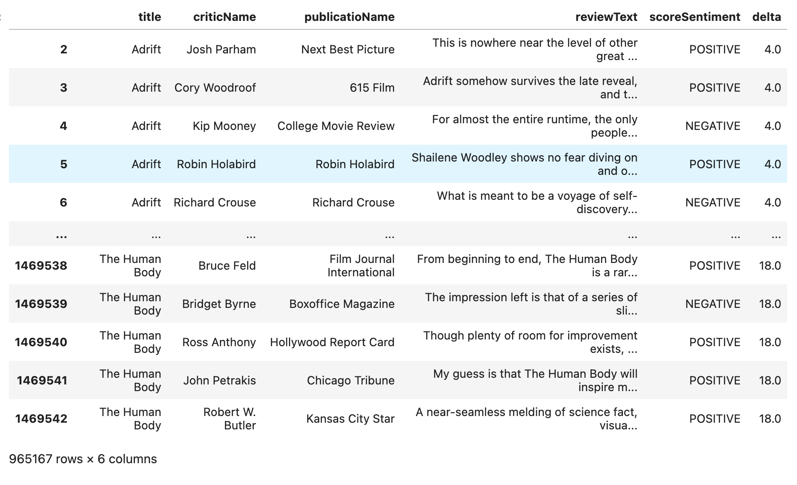
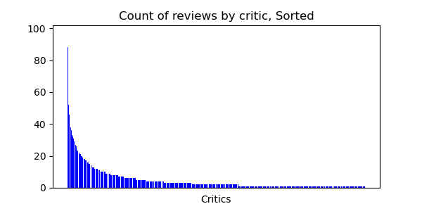
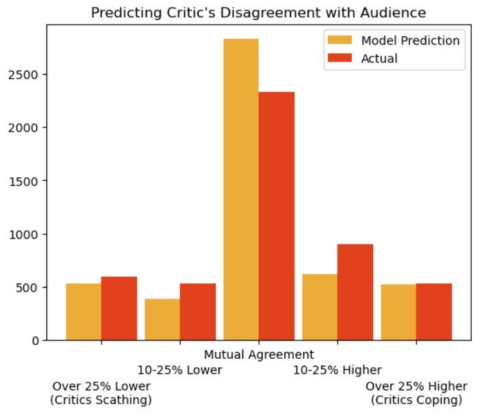
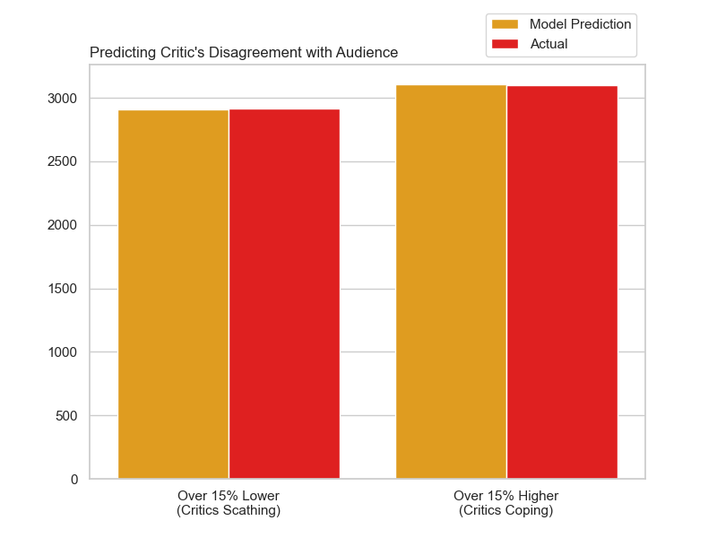
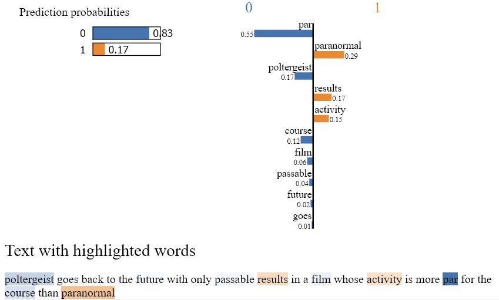
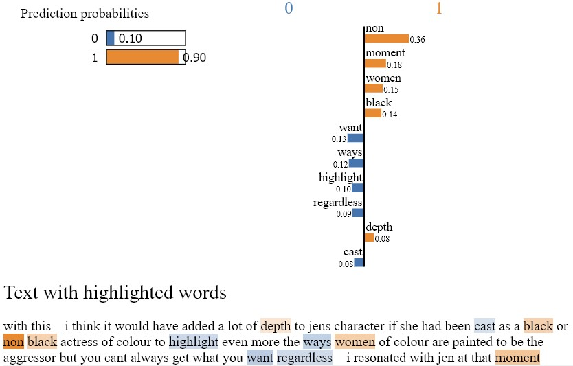
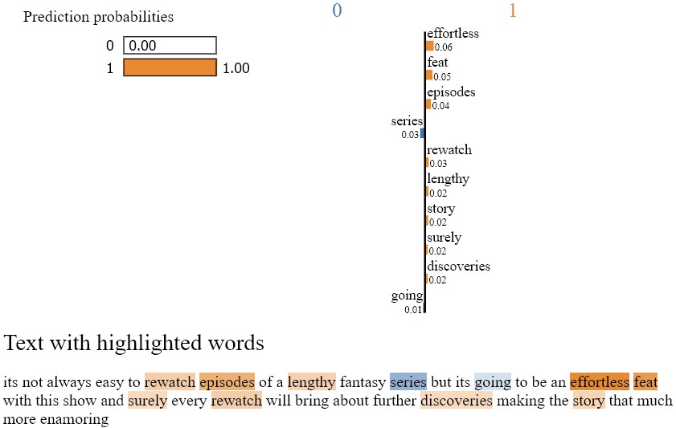
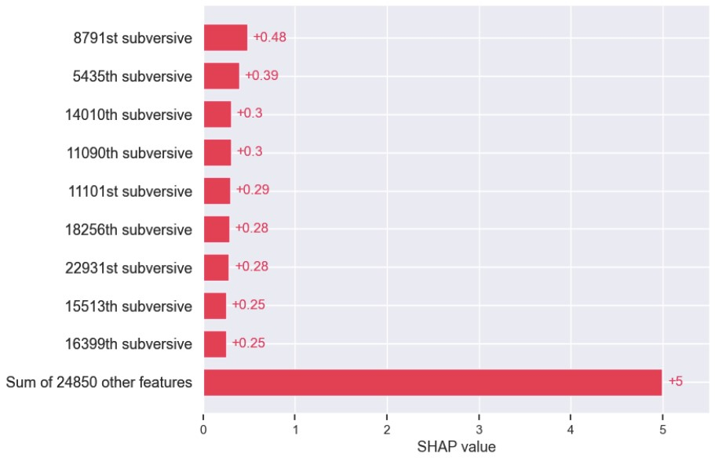
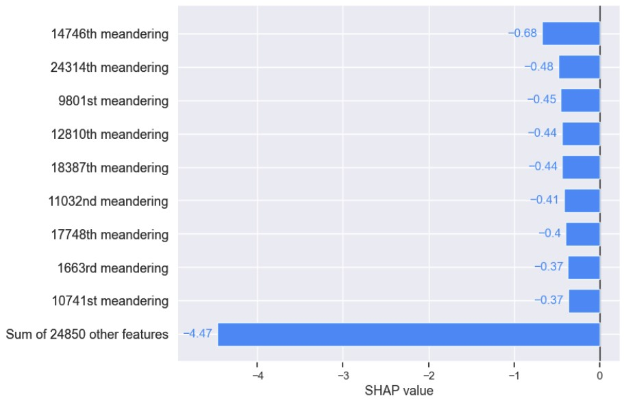
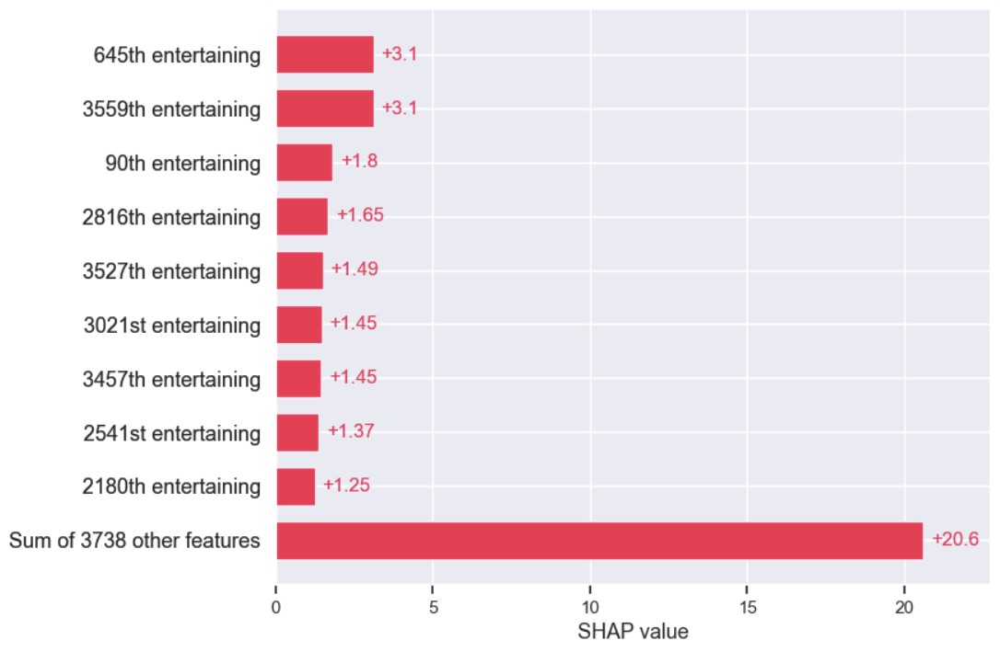

# Comparing Critic and Audience Reviews
### Athen, Donny, and Jim; Oct 5, 2023

***
***
## Intro
Entertainment review sites frequently show a disparity between critic and audience reviews of movies and shows. This project seeks to find features of those critic reviews that diverge from average audience score of a media product.  

***
***
## Source Data
In order to make this analysis, we determined we would need a dataset containing at least an average audience score, an average critic score, and a critic review text associated to a large amount of media titles. After some searching we were able to find this:

[Massive Rotten Tomatoes Movies & Reviews](https://www.kaggle.com/datasets/andrezaza/clapper-massive-rotten-tomatoes-movies-and-reviews?select=rotten_tomatoes_movie_reviews.csv), Andrea Villa, uploaded to Kaggle 2023

This is indeed a "massive" dataset, containing some 1.4 million movie reviews. It consists of two csv files, listed here with their data columns:

* rotten_tomatoes_movies.csv: id, title, audienceScore, tomatoMeter, rating, releaseDateTheaters, releaseDateStreaming, runtimeMinutes, genre, director, and boxOffice revenue.

* rotten_tomatoes_movie_reviews.csv: id, reviewId, creationDate, criticName, isTopCritic, originalScore, reviewState, publicationName, reviewText, scoreSentiment, and reviewUrl.

These csv's had all the data we needed between them, in these columns:
* average audience score: audienceScore
* average critic score: tomatoMeter
* critic review text: reviewText
* media title: title
***
***
## Data Cleaning

* Our first step was to do an inner merge on the two csv's to have all input data within one dataframe. We next created a column for the disparity between critic and audience scores for each movie:
>     massive['delta'] = massive['tomatoMeter'] - massive['audienceScore']

* We then dropped columns that were unlikely to contribute meaningful data to a machine learning model, including the input audience score and critic score used to create 'delta':
```
massive = massive.drop(columns=['originalScore', 'rating', 'ratingContents', 'releaseDateTheaters',
                                'releaseDateStreaming', 'runtimeMinutes', 'genre', 'originalLanguage',
                                'director', 'writer', 'boxOffice', 'distributor', 'soundMix','reviewUrl',
                                'id', 'reviewId', 'creationDate', 'isTopCritic', 'reviewState', 'tomatoMeter',
                                'audienceScore'])
```

* There were several nulls, all of which were in the four specified data columns and could not be reasonably replaced; all these nulls were dropped. 


* As we are focusing on movies with a large discrepancy between critic and audience scores, we selected reviews where this discrepancy was at least 20% either above or below the audience score:


>     condition = (massive['delta'] >= 20) & (massive['scoreSentiment'] == 'POSITIVE')
>          if condition.any():
>          massive = massive.drop(massive[condition].index)
>     condition = (massive['delta'] <= -20) & (massive['scoreSentiment'] == 'NEGATIVE')
>          if condition.any():
>          massive = massive.drop(massive[condition].index)

* Lastly, we considered that there may be duplicated reviews in the remaining data. To be sure to get rid of these, we dropped duplicates in the 'reviewText' column:

>     massive = massive.drop_duplicates(subset='reviewText', keep='first')

* This provided our final cleaned dataframe:



### Random subsampling
* Even after cleaning, our dataframe still contained 965167 rows. In order to be able to process this at all we first took a random subsample of the cleaned data:
>     massive = massive.sample(n=15000)
***
***
## Modeling


### Tokenization
* We also needed to tokenize the text of the review column to perform NLP analysis. Our process for this consisted of removing "stop words" ie very commonly used words that provide little useful data, removing anything containing non-alphabetic characters, setting all words to a base gramatical form (lemma), and encoding the text of reviews as a sequence of tokens:
```
     lemmatizer = WordNetLemmatizer()
     import re
     def process_text(text): 
          sw = set(stopwords.words('english')) 
          regex = re.compile("[^a-zA-Z ]") 
          re_clean = regex.sub('', text) 
          words = word_tokenize(re_clean) 
          lem = [lemmatizer.lemmatize(word) for word in words] 
          output = ' '.join([word.lower() for word in lem if word.lower() not in sw]) 
    return output
    
    massive['reviewText'] = massive['reviewText'].apply(lambda x: process_text(x))
```


***

## TF-IDF Logistic Regression Sentiment Model
Term Frequency-Inverse Document Frequency (TF-IDF) is a measure combining how frequently a term appears within a document (Term Frequency) with the importance of a term within a corpus of documents (Inverse Document Frequency) to assign a weight to each term in a document. Our first model is a proof-of-concept attempt to predict the critic score sentiment, whether 'positive' or 'negative', based on a TF-IDF of the critic reviews.

### Process
* Fit TFIDF vectorizer for sentiment model
```
     tfidf_vectorizer = TfidfVectorizer(max_features=5000)
     X = tfidf_vectorizer.fit_transform(massive['reviewText'])
     y = massive['scoreSentiment']
```
* Split the data into training and testing sets
```
     X_train, X_test, y_train, y_test = train_test_split(X, y, test_size=0.25, random_state=42)

```
* Train Logistic Regression model
```
     model = LogisticRegression(max_iter=5000)
     model.fit(X_train, y_train)
```

### Results:
```
    model.score(X_train, y_train)
    0.8237333333333333
    
    model.score(X_test, y_test)    
    0.76
```
This model works very well, however it is only a proof-of-concept for using TF-IDF on the review text data, matching critic reviews to critic sentiment. 
***
## TF-IDF Linear regression on 'delta' (critic-audience score discrepancy)
### Process

* Rename 'title' column to 'title_' to prevent confusion with instances of the word "title" in vectorized or dummy columns

* Vectorizing original 'reviewText' to dense array for linear model and combine with original dataframe, drop 'reviewText' now that vectorized words are all columns. Replace nulls in vectorized columns with 0.
```
     tfidf_dense = tfidf_vectorizer.fit_transform(massive['reviewText']).todense()
     new_cols = tfidf_vectorizer.get_feature_names()
     combined = massive.join(pd.DataFrame(tfidf_dense, columns=new_cols))

     combined = combined.drop(columns=['reviewText'])

     combined = combined.fillna(0)
```
* Limit populations of critics and publications: As shown, the number of reviews per critic and per publication were sharply distributed. We therefore decided to sort the right tail of critic and publication distributions into an "other" category before encoding these categorical data columns in order to limit the number of dummy values in models using these columns. Thresholds for the minimum number of reviews to set critics and publications as their own category were manually selected.




```
counts = combined.criticName.value_counts()
threshold = combined.criticName.isin(counts.index[counts<16])
combined.loc[threshold, 'criticName'] = 'Other'
```

```
counts = combined.publicatioName.value_counts()
threshold = combined.publicatioName.isin(counts.index[counts<12])
combined.loc[threshold, 'publicatioName'] = 'Other'
```
* Encode dummy values for categorical data columns: 'title_', 'criticName', 'publicatioName', 'scoreSentiment'
```
     categorical_cols = ['title_', 'criticName', 'publicatioName', 'scoreSentiment']
     combined = pd.get_dummies(combined, columns = categorical_cols)


```
* Set 'delta' as target and remaining columns as X
```
     X = combined.drop(columns=['delta'])
     y = combined['delta']
```

* Split the data into training and testing sets
```
     X_train, X_test, y_train, y_test = train_test_split(X, y, test_size=0.25, random_state=42)
```
* Scale X
```
     sc = StandardScaler()
     X_train_sc = sc.fit_transform(X_train)
     X_test_sc = sc.transform(X_test)
```

* Perform Principle Component Analysis (PCA)
```
     pca = PCA(n_components=500)
     X_train_p = pca.fit_transform(X_train_sc)
     X_test_p = pca.transform(X_test_sc)
```
* Train Linear Regression model
```
     model = LinearRegression()
     model.fit(X_train_p, y_train)
```
### Results:
* Model scores:
```
     model.score(X_train_p, y_train)
     0.28077819576737584
     
     model.score(X_test_p, y_test)
     0.1758836524732681
     
```
* y predictions:
```
     predictions = model.predict(X_test_p)
     
     predictions.mean()
     0.9831749268123526
     
     predictions.min()
     -29.810990313343122
     
     y_test.mean()
     0.9017618793379605
     
     y_test.min()
     -64.0
```
* r2:
```
     from sklearn.metrics import mean_squared_error, mean_absolute_error, r2_score
     r2 = r2_score(y_test, predictions)
     r2
     0.1758836524732681
```


***
## BERT Linear Regression model on 'delta' (critic-audience score discrepancy)
Bidirectional Encoder Representations from Transformers (BERT) is an open source natural language processing model developed by Google AI and released in 2018. 
* Pull tokenizer and model from Hugging Face library
```
     tokenizer = AutoTokenizer.from_pretrained("activebus/BERT_Review")
     model = AutoModel.from_pretrained("activebus/BERT_Review")
```
* Text preprocessing function
```
     def preprocess(text):
         new_text = []
         for t in text.split(" "):
             t = '@user' if t.startswith('@') and len(t) > 1 else t
             t = 'http' if t.startswith('http') else t
             new_text.append(t)
         return " ".join(new_text)
```
* Function to vectorize text with BERT
```
     def get_embedding(text):
         text = preprocess(text)
         encoded_input = tokenizer(text, return_tensors='pt')
         features = model(**encoded_input)
         features = features[0].detach().numpy() 
         features_mean = np.mean(features[0], axis=0) 
         return features_mean
         
```
* Applying the function to reviewText and outputting to embeddings column
```
     massive['embeddings'] = massive.reviewText.map(lambda x: get_embedding(x))
```
* Converting embeddings column to numpy array
```
     vectors = np.array(massive.embeddings.tolist(), dtype='float')
     vectors[:10]
```
* Flattening numpy array and creating dataframe with it
```
     v_df = pd.DataFrame(vectors, columns=[f'col{i+1}' for i in range(vectors.shape[1])])
```
* Drop review text now it is vectorized, and drop embeddings now that it is flattened
```
     massive = massive.drop(columns=['reviewText', 'embeddings'])
```
* Limit populations of critics and publications: as previously for TF-IDF Linear Regression model 
* Encode dummy values for categorical data columns: 'title_', 'criticName', 'publicatioName', 'scoreSentiment'
* Merging massive df with vectorized df
```
     combined = pd.concat([massive, v_df], axis=1)
     combined.head(1)
```
* Set 'delta' as target and remaining columns as X
* Split the data into training and testing sets
* Scale X
* Perform Principle Component Analysis (PCA)
* Choose a machine learning model (e.g., Logistic Regression) and train it
## Results:
```
     model.score(X_train_p, y_train)
     0.9227881013926973
     
     model.score(X_test_p, y_test)
     0.5212681489904241
```

## BERT Logistic Regression Models:
Finally we applied everything we learned and implemented a logistic regression model by dividing the delta values by into either five or two categories. We were happy with the final results.

## Results:
* Model scores when classified into 5 categories:
```
     model.score(X_train_p, y_train)
     1.0
     
     model.score(X_test_p, y_test)
     0.8238543371522095
```
* Model scores when classified into binary categories:
```
     model.score(X_train_p, y_train)
     1.0
     
     model.score(X_test_p, y_test)
     0.9790454016298021
```
### Categorical Predictions vs true data

### Binary Predictions vs true data

***
## LIME
Local Interpretable Model-agnostic Explanations (LIME) is a technique designed to provide interpretable explanations for the predictions of complex machine learning models, especially black-box models. Developed to enhance the transparency and interpretability of predictive models, LIME aims to help users understand why a particular instance was classified or predicted in a certain way. Below are plots showing a LIME analysis of select passages from our dataset.




## SHAP 
SHapley Additive exPlanations (SHAP) is a model-agnostic framework and set of techniques used for explaining the output of machine learning models. In this case, we are using it to determine what word tokens are influential in our models' determinations. Below are plots showing a SHAP analysis of select passages from our dataset.




***
***


***
***
## Conclusions
### Difficulties:
* massive dataset
* needed time to run on larger sample of data
* time to run more complex models (SVC, Gradient Boosted Tree)
* additional/modified steps in preprocessing?
### Successes:
* categorization of delta column and focus on classification models lead to better results
